# Mousiki User Guide

This guide walks through **every entry of the in-app cheat sheet** (`?`) in the same order the cheat sheet lists them, and explains what each command does. Some settings that can only be change in the config.txt are also discussed at the end of this manual. 
The key shown for each command is the **default binding**. Your own bindings may differ if you changed them in `config.txt` or under **Settings → Reference**; the cheat sheet always shows the keys you actually have.

---

## Contents

[Before you start](#before-you-start)
[1. System (main UI)](#1-system-main-ui)
[2. Playback (main UI)](#2-playback-main-ui)
[3. Navigation & view (main UI)](#3-navigation--view-main-ui)
[4. Search (main UI)](#4-search-main-ui)
[5. Queue (main UI)](#5-queue-main-ui)
[6. Playlists](#6-playlists)
[7. Meta editor](#7-meta-editor)
[8. History](#8-history)
[9. Downloads](#9-downloads)
[10. Settings (individual tabs)](#10-settings-individual-tabs)
[About this App](#About-this-app)

---

## Before you start

### Rebindable vs. fixed keys

- **Rebindable keys** have an action name like `HKeyPlay` in `config.txt` and appear under **Settings → Reference**. Change them in either place.
- **Fixed keys** are written as literal key names in the cheat sheet (for example `ESC`, `SHIFT+B`, `CTRL+SHIFT+S`, or the keys inside the playlist and meta editors). These cannot be rebound.

### Uppercase letters

Several commands use **Shift + letter** (`T`, `N`, `M`, `P`, `H`, `X`) because the plain lowercase letter already does something else. Where this guide writes `SHIFT+T`, it means the uppercase `T`.

### The main screen

The main screen has a **local/online/playlist list** on the left (titled `LOCAL AUDIO FILES`, `ONLINE RESULTS` or `SAVED PLAYLISTS`), a **Queue** panel, a metadata panel with lyrics or a visualizer, and a search box. Only one of the list or the queue has **focus** at a time. Focus decides where the arrow keys work (see `TAB` below).

### Play mode letter

The small box next to the search bar shows the current play mode as a letter: `L` list, `R` repeat, `S` shuffle, `O` stop, `Q` repeat queue.

---

## 1. System (main UI)

| Key | Action | What it does |
|---|---|---|
| `s` | Open Settings | Opens the Settings panel (see [Settings](#10-settings-individual-tabs) for every tab). Inside Settings, pressing `s` again **saves to `config.txt` and returns** to the main screen. `ESC` or `q` returns **without saving right now** (see the Settings section for what that means). |
| `t` | Console / logs | Opens a read-only log view showing what the app has been doing (sort changes, filter changes, queue messages, load timings and so on). Close it with `ESC`, `t` or `T`. |
| `?` | Cheat sheet | Opens the command list. Use `↑`/`↓` to scroll (the list is longer than most terminal windows). Close with `?` or `ESC`. |
| `q` | Quit | Quits the application from the main screen. |
| `ESC` | Close / back | Closes whatever is open (Settings, an overlay, a menu, a prompt). On the **main screen** it returns to the *home view*: the full local library, with no search query and no folder filter, scrolled to the top. It does not change the sort mode. |
| `ENTER` | Confirm / select | Confirms the highlighted choice or starts the highlighted item. What it does depends on where you are (play a track, queue a playlist, commit a search and so on). |
| `ARROW KEYS` | Navigate | Move up and down through lists, left and right to seek or move a text caret. What they do depends on the current screen. |
| `Y` / `N` | Confirm or cancel a prompt | Answers Yes/No prompts such as "Want to clear queue?" or "Fetching metadata via AcoustID … Continue?". |

**Tips**

- Almost every overlay closes with `ESC`.
- Prompts swallow other keys while they are open, so nothing underneath can be triggered by accident.
**The cheat sheet (`?`)** is the screen this guide follows. The footer shows how far you have scrolled (`1/87`).

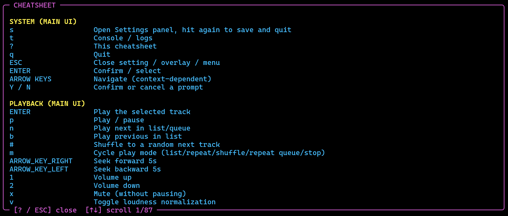

*The cheat sheet, opened with `?`. Scroll with `↑`/`↓`; `?` or `ESC` closes it.*

---

## 2. Playback (main UI)

The main screen while a track plays: the disk, the metadata panel, the visualizer and the lyrics area at the top, then the progress bar with its waveform, the volume bar, the search box, and the local file list and queue at the bottom. The box on the right of the search bar shows the play mode letter (here `S` for shuffle).

*Main screen with the lyrics engine on: the lyrics fill the right-hand area.*

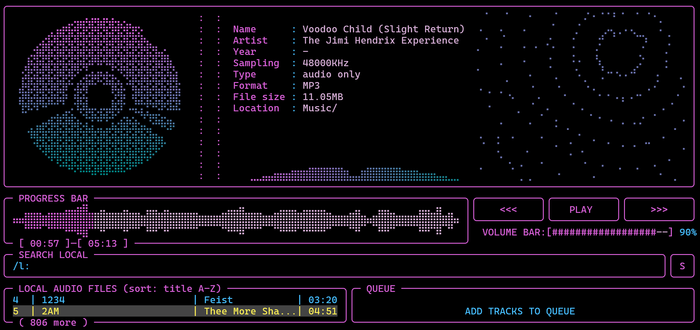

*Main screen with no lyrics shown: the audio-reactive **lyric ball** (Settings → ON/OFF → Lyric Ball) fills the area instead.*

| Key | Action | What it does |
|---|---|---|
| `ENTER` | Play the selected track | Starts the highlighted track. Pressing it again on the same track reloads it. On a **playlist row** it does not play. It queues every track in that playlist instead. |
| `p` | Play / pause | Pauses or resumes the current track. |
| `n` | Next | Plays the next track. If the **queue** has items, the next queue item plays. Otherwise the next track in the list plays (relative to what is *playing*, not where your cursor is). A manual skip always skips, even in repeat or stop mode. |
| `b` | Previous | Plays the previous track in the list. There is no queue equivalent, because a queue that has been consumed has no meaningful "previous". |
| `#` | Shuffle next | A one-off jump to a **random track from the current list**. It ignores the queue on purpose and is independent of the shuffle play mode. |
| `m` | Cycle play mode | Steps through the five play modes (see below). |
| `→` | Seek forward | Jumps forward **5 seconds**. |
| `←` | Seek backward | Jumps back **5 seconds**. |
| `1` | Volume up | Raises the in-app volume in steps of 5 (up to 100). |
| `2` | Volume down | Lowers the in-app volume in steps of 5 (down to 0). |
| `x` | Mute | Sets the volume to 0 without pausing. Pressing it again restores the previous volume. |
| `v` | Toggle loudness normalization | Turns loudness normalization on or off, so you can compare a track with and without it. When turned on, the status line shows the track's measured loudness and the correction applied. The target and maximum boost are set in **Settings → Reference** (loudness section) or `config.txt`. |

### The five play modes (`m`)

Each press moves to the next mode in this order: **list → repeat → shuffle → stop → repeat queue → list …**

| Mode | Letter | Behavior when a track finishes |
|---|---|---|
| List | `L` | Plays the next track in the list (the queue takes priority when it has items). |
| Repeat | `R` | Replays the same track again. |
| Shuffle | `S` | Plays a random track. If the queue has more than one item, a random queue item is chosen. |
| Stop | `O` | Plays the track and then stops, with no automatic advance. The "no track loaded" screen with the cassette is shown. |
| Repeat queue | `Q` | The queue loops: each played item is moved to the back instead of being removed. With an empty queue it behaves like list mode. |

---

## 3. Navigation & view (main UI)

| Key | Action | What it does |
|---|---|---|
| `↑` | Explore list up | Moves the highlight up in the focused panel (list or queue). |
| `↓` | Explore list down | Moves the highlight down in the focused panel. |
| `TAB` | Switch between panels | Moves focus between the **list** and the **queue**. This decides which panel the up/down arrows, `d` (remove), `4`/`5` (move) and `a` (add / bulk add) act on. |
| `f` | Filter by folder | Narrows the local list to the **folder of the highlighted track**. It also switches the sort back to *folder order*. The pane title then shows `sort: folder order, folder: <name> [c] clear`. The filter stacks on top of an active search. |
| `c` | Clear filter | Removes the folder filter. It leaves the sort mode alone. |
| `T` (Shift+T) | Cycle local list sort mode | Cycles the sort of the local list through three modes: **folder order → title A-Z → artist A-Z**. The current mode is shown in the pane title (see below). |
| `k` | Refresh UI | Forces a full redraw. Use it when a terminal resize or a switch of terminal session left the screen torn or stale. |
| `w` | Toggle waveform style | Switches the waveform between **raw** and **smooth**. |
| `+` | Toggle lyrics on/off | Turns the lyrics engine on or off. While off, the lyrics area shows the sphere visualizer and no lyrics are fetched from the network. Turning it on mid-track fetches lyrics for the current track right away. |
| `N` (Shift+N) | Toggle metadata-only track list | Switches every list row between **filename** and **metadata title** (the embedded title tag). Files with no title tag, or whose tags have not been read yet, keep showing their filename. This also switches what "title A-Z" sorts by (see below). Also available in **Settings → ON/OFF**. |
| `l` | Retry lyrics | Opens a small form to fetch lyrics again with a **manual title and artist**. Use it when the automatic match was wrong. |

### How the sort mode and `SHIFT+N` work together

The sort mode in the pane title always tells you what is being sorted on:

| Sort mode | Pane title shows | Sorted by |
|---|---|---|
| Folder order | `sort: folder order` | The order the files were found on disk |
| Title A-Z, `SHIFT+N` **off** | `sort: file name A-Z` | The file name |
| Title A-Z, `SHIFT+N` **on** | `sort: title A-Z` | The embedded title tag (falling back to the file name where there is none) |
| Artist A-Z | `sort: artist A-Z` | The artist tag (falling back to the artist guessed from the parent folder) |

Toggling `SHIFT+N` re-sorts the list immediately and keeps your cursor on the same track. In **metadata-only** mode the order can shift slightly right after startup, while the background scan is still reading tags.

A **search** always ranks by match quality, so while a query is active the sort mode is not used. It applies again once the query is cleared.

### How the lyrics form (`l`) works

| Key in the form | Function |
|---|---|
| `TAB` / `↓` | Next field |
| `↑` | Previous field |
| `SPACE` | Tick or untick a checkbox (slowed, ultra-slowed, sped up, reverb, remix, other). Slowed, ultra-slowed and sped up are mutually exclusive. |
| Typing | Fills the text fields |
| `ENTER` | Fetch lyrics with these settings (works from any field) |
| `ESC` | Cancel |

`l` only works while the lyrics engine is on (`+`).

---

## 4. Search (main UI)

| Key | Action | What it does |
|---|---|---|
| `/` | Search local folder | Opens the search box. The list updates **live as you type**. Press `ENTER` to keep the result, or `ESC` to cancel and restore the previous view. |
| `/s:` + query | Search online (YouTube) | Type `s:` followed by your query, then press `ENTER`. Online searches only run on `ENTER`, never per keystroke. |
| `/p:` + query | Search saved playlists | Type `p:` followed by part of a playlist name. The playlist list filters live. `ENTER` on a playlist row queues all of its tracks. |

**Local search details**

- The search is **fuzzy**. For example "X Files" also finds "X-Files".
- It matches the file name, the artist, the embedded title tag and the album tag. Files whose tags have not been read yet can still be found by file name.
- Results are ranked purely by match quality, best first.
- While the search box is open, `↑`/`↓` move through the live preview. `←`/`→` move the text caret, and `SHIFT+←/→` marks text.
- A folder filter (`f`) keeps applying to search results.

---

## 5. Queue (main UI)

The queue is a list of tracks that play **before** the normal list continues. Press `TAB` to move focus into the queue panel when you want the arrow keys or `d`, `4`, `5` to work on it.

| Key | Action | What it does |
|---|---|---|
| `a` | Add hovering track to queue | With the **list** focused, adds the highlighted track (or, on a playlist row, all its tracks) to the end of the queue. With the **queue** focused, it opens the **bulk-add** panel instead (see below). |
| `d` | Remove hovering track from queue | Removes the highlighted queue item. Focus the queue with `TAB` first. |
| `4` | Move hovering queue item up | Moves the highlighted queue item one place up. Focus the queue first. |
| `5` | Move hovering queue item down | Moves the highlighted queue item one place down. Focus the queue first. |
| `X` (Shift+X) | Clear the whole queue | Asks "Want to clear queue?" first. See below. |

### Clear queue prompt (`SHIFT+X`)

The prompt starts on **No**, so an accidental `ENTER` never wipes the queue.

| Key | Result |
|---|---|
| `←` | Highlight Yes |
| `→` | Highlight No |
| `TAB` | Toggle between Yes and No |
| `ENTER` | Take the highlighted answer |
| `y` | Yes: clear the queue |
| `n`, `ESC` or any other key | No: cancel |

If the queue is already empty, the status line just says so.

### Bulk add (`a` with the queue focused)

Paste a YouTube playlist link to queue tracks from it.

1. **Type or paste the link** and press `ENTER` to fetch it (`ESC` cancels).
2. Once the results appear: `↑`/`↓` move, `SPACE` stars or unstars a row, `a` queues **all** of them, and `ENTER` queues **only the starred** ones.
3. `ESC` throws everything away.

---

## 6. Playlists

`P` (Shift+P) opens the **playlist editor**, a full-screen overlay for building playlists from your local (or downloaded) tracks. It has two tabs: **Create/Edit** and **Saved Playlists**. Playlists are used from the main screen with `/p:` (see [Search](#4-search-main-ui)).

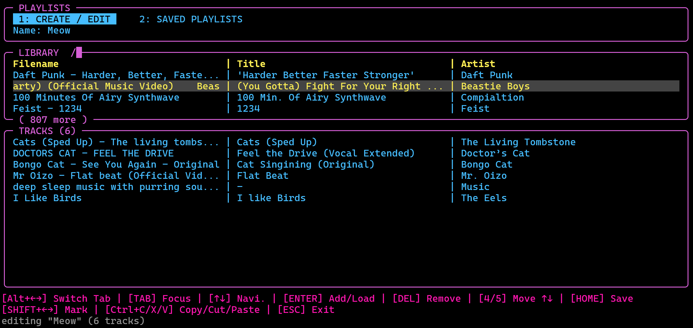

***Create / Edit** tab: the name field, the library picker with its search (`/`), and the tracks of the playlist being built.*

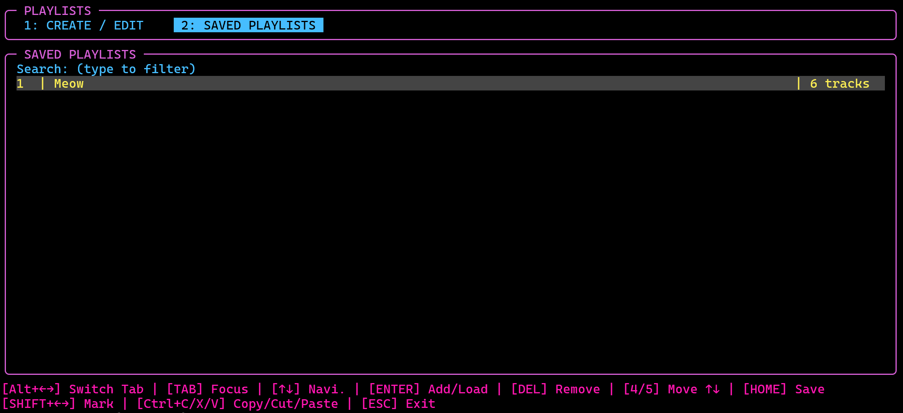

***Saved Playlists** tab: the search field and the list of saved playlists with their track counts.*

| Key | What it does |
|---|---|
| `P` | Open Playlists (create / manage) |
| `ALT+←` / `ALT+→` | Switch between the Create/Edit tab and the Saved Playlists tab. Alt is used because plain arrows are needed for the text fields. |
| `TAB` | Cycle focus. On Create/Edit: name field → library picker → track list. On Saved Playlists: search box ↔ list. |
| `↑` / `↓` | Move through the focused list or picker |
| `ENTER` | Depends on focus. See the table below. |
| `4` / `5` | Move the highlighted track up or down in the playlist you are building |
| `D` / `DEL` / `BACKSPACE` | Remove the highlighted track (track list focused). On the Saved Playlists tab, `DEL` deletes the selected playlist after a Yes/No confirmation. |
| `HOME` | Save the playlist |
| `SHIFT+←` / `SHIFT+→` | Mark text in the name and search fields |
| `CTRL+C` / `CTRL+X` / `CTRL+V` | Copy, cut and paste text in those fields |

### What `ENTER` does in the playlist editor

| Where | Result |
|---|---|
| Name field | Confirms the name and jumps to the library picker |
| Library picker | Adds the highlighted track to the playlist. (Typing in this pane filters the library live.) |
| Saved Playlists, search box | Moves focus to the list |
| Saved Playlists, list | Loads the selected playlist into the editor |

### Leaving

`ESC` closes the editor. If there are unsaved changes on the Create/Edit tab, it asks whether to save: `y` saves, `n` discards and leaves, `ESC` cancels the question and keeps editing.

---

## 7. Meta editor

`M` (Shift+M) opens the **meta/tag editor** for changing a file's **file name**, **artist**, **title**, **album** and **year**, and for looking up missing tags with AcoustID (an audio-fingerprint service).

**Important safety rules**

- Editing never touches your files directly. All changes go into a **pending edit session**, which is autosaved after every keystroke to `~/.cache/mousiki/meta_session/`. Closing the editor, quitting, or even a crash keeps the session.
- Touched fields and the matching library rows are drawn in the **header colour**, so you can see what will be written.
- Only `CTRL+SHIFT+S` writes to the files, and it asks first.

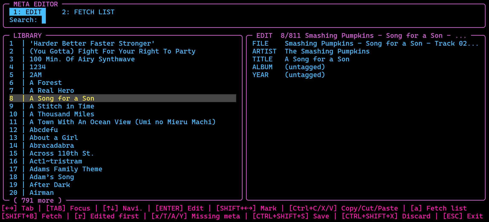

***Edit** tab: the search field, the library on the left, and the five fields (FILE, ARTIST, TITLE, ALBUM, YEAR) of the highlighted file on the right. The footer lists every key.*

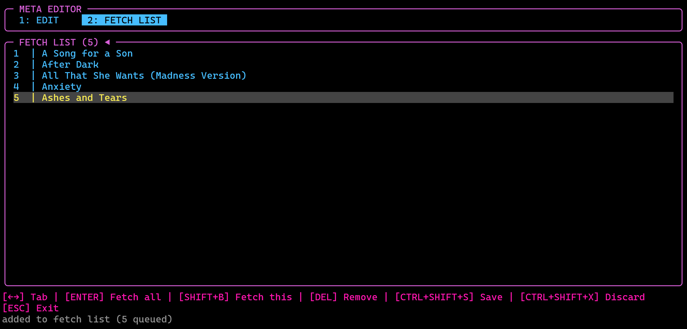

***Fetch List** tab: the titles queued for an AcoustID lookup. The status line below the footer confirms what was added.*

| Key | What it does |
|---|---|
| `M` | Open the meta editor |
| `←` / `→` | Switch between the **Edit** tab and the **Fetch List** tab. (While you are typing in a field, they move the text caret instead.) |
| `TAB` | Cycle panels on the Edit tab: search field → library → field editor |
| `↑` / `↓` | Move through the focused list, or between the five fields in the field editor |
| `ENTER` | Depends on focus (see below). On the **Fetch List** tab it fetches metadata for the whole list. |
| `SHIFT+←` / `SHIFT+→` | Mark text in the field editor |
| `CTRL+C` / `CTRL+X` / `CTRL+V` | Copy, cut, paste in the field editor |
| `a` | Add the highlighted file to the **fetch list** (library focused) |
| `r` | Toggle **edited files on top** of the library pane |
| `x` | Filter the library to files missing **any** metadata (library pane focused; press again to clear) |
| `SHIFT+T` | Filter the library to files missing a **title** (press again to clear) |
| `SHIFT+A` | Filter the library to files missing an **artist** (press again to clear) |
| `SHIFT+Y` | Filter the library to files missing a **year** (press again to clear) |
| `SHIFT+B` | Fetch metadata for the highlighted title via AcoustID (asks first) |
| `DEL` / `d` | Remove the highlighted title from the **fetch list**. It only takes a title off that list: it never deletes the file and does not touch pending edits. If the title is not on the fetch list, the status line says `not on the fetch list`. |
| `CTRL+SHIFT+S` | Apply all pending edits to the files (asks first) |
| `CTRL+SHIFT+X` | Discard all pending edits (asks first) |
| `ESC` | Close the editor (the session is kept) |

### What `ENTER` does in the meta editor

| Where | Result |
|---|---|
| Search field | Keeps the filter and moves to the library list |
| Library list | Starts editing the highlighted file's fields |
| Field editor | Finishes editing this field and goes back to the library |
| Fetch List tab | Fetch metadata for every title in the list (asks first) |

### Using the AcoustID lookup

- `SHIFT+B` looks up one title. It works from the meta editor and also directly from the **main list** (only for local files).
- `a` collects titles into the fetch list, and `ENTER` on the Fetch List tab runs them as a batch.
- Before anything is fetched you get the disclaimer that the result is not always accurate and previous metadata will be overwritten. Answer with `y`, `n` or `ESC`.
- Results only land in the **edit session**, never directly in the files. Low-confidence matches are reported as "no match" rather than written as wrong tags.
- Applying (`CTRL+SHIFT+S`) writes the tags without re-encoding the audio. A file name edit becomes a plain rename.

---

## 8. History

`H` (Shift+H) opens the **listening history** overlay, with three tabs. Nothing you do here changes your music.

| Key | What it does |
|---|---|
| `H` | Open the history (and close it again). `ESC` and `q` also close it. |
| `1` / `2` / `3` | Jump to the tab: **1 History**, **2 Top Tracks**, **3 Habits** |
| `←` / `→` / `TAB` | Move between tabs (on Top Tracks, `TAB` switches panes instead, see below) |
| `↑` / `↓` | Move the cursor in History and Top Tracks. On Habits they scroll. |
| `r` | On **Top Tracks**: flip between *most played first* and *least played first* |
| `TAB` | On **Top Tracks**: switch between the track list and the **ADD TOP TRACKS TO QUEUE** pane |
| `ENTER` | In the ADD TOP TRACKS TO QUEUE pane: queue the top 10 / 25 / 50 / 100 tracks (whichever is selected with `↑`/`↓`) |

### The three tabs

- **History**: the last 100 plays.
- **Top Tracks**: one row per title with its length and play count, sorted by play count.
- **Habits**: listening statistics, including average session length, listening time per day, tracks per session, skips, replays and completion rates.

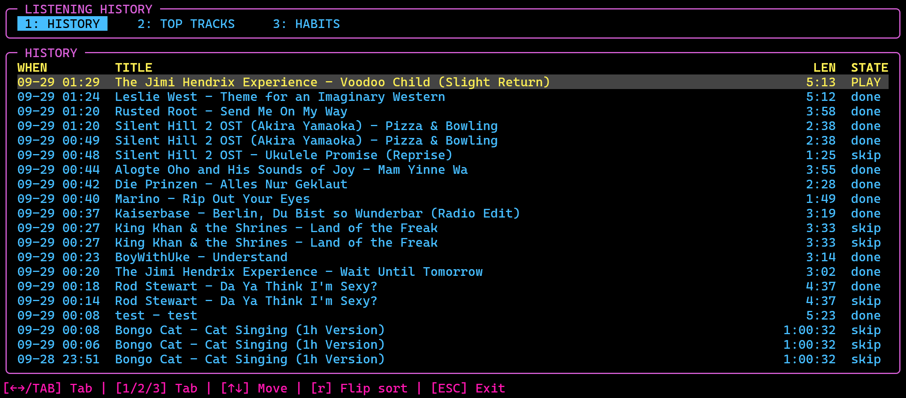

***History** tab: when each track was played, its title, its length and its state (`PLAY` = playing now, `done` = played to the end, `skip` = skipped).*

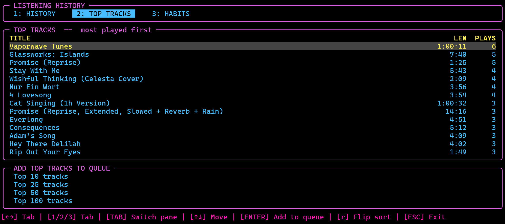

***Top Tracks** tab: titles by play count, with the **ADD TOP TRACKS TO QUEUE** pane underneath.*

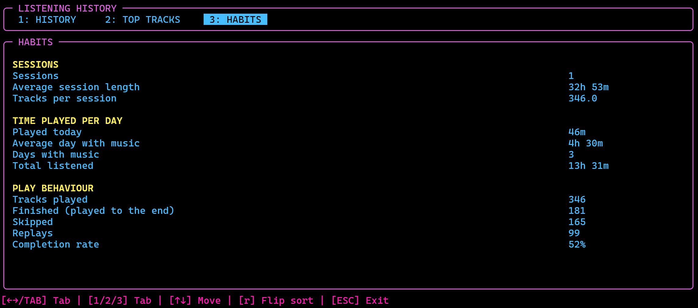

***Habits** tab: sessions, time played per day, and play behaviour.*

### Adding top tracks to the queue

1. Press `2` for Top Tracks.
2. Press `TAB` to move to the lower pane.
3. Use `↑`/`↓` to pick 10, 25, 50 or 100.
4. Press `ENTER`.

"Top N" always means the **N most-played titles**, even if you flipped the list with `r`. Files that have been moved or deleted since they were played are skipped, and the status line reports how many were queued and how many were missing. Online tracks are queued as online tracks.

---

## 9. Downloads

| Key | Action | What it does |
|---|---|---|
| `y` | Save stream | Saves the **currently playing streamed track** into your download folder (**Settings → Download Folder**, or `~/.cache/mousiki` if none is set). The file is named `Title - Artist.ext`, the cached copy is removed, and the library refreshes so the file appears as a local track. |

Status messages:

- `saved to <path>`: success
- `already saved: <name>`: a file with that name is already in the folder
- `not a cached stream`: the current track is a regular local file, so there is nothing to download

---

## 10. Settings (individual tabs)

Press `s` on the main screen to open **Settings**. It has five tabs: **COLORS**, **ON/OFF**, **ANIMATION**, **REFERENCE** and **ABOUT APP**. The footer shows `[TAB] Switch | [↑↓←→] Navigate/Cycle | [ENTER] Edit | [S] Save | [Q] Quit`, and the status line below it reports what just changed.

### Moving around and editing (all tabs)

| Key | What it does |
|---|---|
| `TAB` | Next tab (wraps from ABOUT APP back to COLORS). The cursor returns to the first row. |
| `↑` / `↓` | Previous or next row. On ABOUT APP they scroll the text. |
| `←` / `→` | On a row with a fixed list of values (switches, sliders, choices), steps through the values and applies the change **immediately**. On COLORS they move between the first and second cell of a row instead. |
| `ENTER` | Edits the value in place as free text. Not available on ABOUT APP or on the read-only rows of REFERENCE. |
| `s` | **Saves to `config.txt` and returns** to the main screen. |
| `ESC` / `q` | Returns to the main screen without writing `config.txt` at that moment. |

**Good to know**

- Every change is **live**. It takes effect as soon as you make it.
- The configuration is also written to `config.txt` **whenever you quit the app normally**. `ESC`/`q` therefore only skips the immediate save. The changes still apply for the session and are lost only if the app is killed before it can quit normally.
- **Text editing** (after `ENTER`): `←`/`→` move the caret, `SHIFT+←/→` mark text, `HOME`/`END` jump, `DEL`/`BACKSPACE` delete, `CTRL+C/X/V` copy, cut and paste. `ENTER` confirms, `ESC` cancels and discards the edit. Ordinary fields hold up to 18 characters, folder paths up to 240.

### Tab 1: COLORS

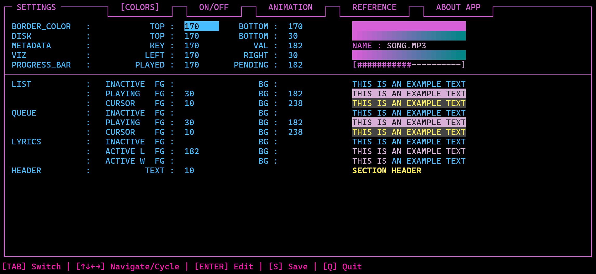

*The COLORS tab with the live preview on the right.*

Sets the colours of the interface. There are **15 rows**, each with a name, one or two value cells, and a **live preview** on the right.

**Values** are numbers from the 256-colour terminal palette (`1`–`255`). `0` or an empty field means "no colour", so the terminal's own default is used. Values in the ranges 30–47 and 90–107 are used as direct terminal colour codes.

| Row | First cell | Second cell | What it colours |
|---|---|---|---|
| BORDER_COLOR | TOP | BOTTOM | The frame lines, fading from top to bottom. |
| DISK | TOP | BOTTOM | The spinning disk (gradient). |
| METADATA | KEY | VAL | The labels and the values in the metadata panel. |
| VIZ | LEFT | RIGHT | The visualizer bars (gradient). |
| PROGRESS_BAR | PLAYED | PENDING | The played and the remaining part of the progress bar. |
| LIST | INACTIVE FG | BG | Ordinary rows of the track list (text / background). |
| | PLAYING FG | BG | The row of the track that is playing. |
| | CURSOR FG | BG | The highlighted (hovering) row. |
| QUEUE | INACTIVE FG | BG | Ordinary rows of the queue. |
| | PLAYING FG | BG | The queue row that is playing. |
| | CURSOR FG | BG | The highlighted queue row. |
| LYRICS | INACTIVE FG | BG | Lyric lines that are not active. |
| | ACTIVE L FG | BG | The active line. |
| | ACTIVE W FG | BG | The active word. |
| HEADER | TEXT | none | The section titles in Reference and in the ON/OFF path lists. Text colour only, no background. |

`FG` is the text colour, `BG` the background. Use `←`/`→` to pick the cell, then `ENTER` to type a new number.

### Tab 2: ON/OFF

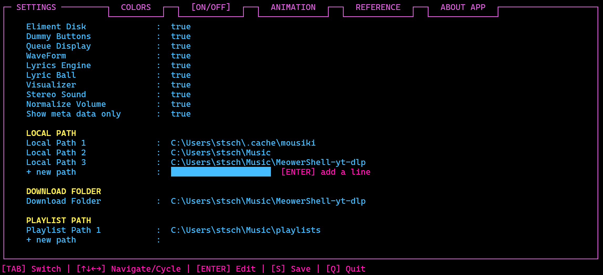

*The ON/OFF tab: switches at the top, then the LOCAL PATH, DOWNLOAD FOLDER and PLAYLIST PATH lists.*

The first part is a list of **true/false switches** (change them with `←`/`→`). Below it are the folder settings, which you edit with `ENTER`.

| Setting | What it does |
|---|---|
| Eliment Disk | Shows or hides the spinning disk in the player area. |
| Dummy Buttons | Shows or hides the three decorative buttons next to the progress bar. |
| Queue Display | Shows or hides the Queue panel. |
| WaveForm | Shows or hides the waveform. With it off, a plain bar is drawn instead. |
| Lyrics Engine | Turns lyric fetching and display on or off. Same as the `+` key. |
| Lyric Ball | Draws the audio-reactive sphere in the lyrics area while a track is loaded. |
| Visualizer | Shows or hides the spectrum visualizer. |
| Stereo Sound | On plays in stereo (about twice the memory per loaded track), off folds left and right into mono. Turning it **off** is immediate. Turning it **on** applies from the next track. |
| Normalize Volume | Loudness normalization on or off. Same as the `v` key. Target and boost are set on the REFERENCE tab. |
| Show meta data only | Rows show the embedded title tag instead of the file name. Same as `SHIFT+N`. The list is re-sorted straight away. |

**Folder lists** (the tab scrolls with the cursor, so a short terminal is fine):

| Section | Rows | What it does |
|---|---|---|
| LOCAL PATH | `Local Path 1`, `2`, … plus `+ new path` | The folders scanned for music. `ENTER` edits one. `+ new path` (`ENTER`) adds an empty line and opens it for typing. Committing a change **rescans the library immediately**. |
| DOWNLOAD FOLDER | one row | Where `y` (Save stream) puts downloaded tracks. Until you set one it shows the default cache folder (`~/.cache/mousiki`). It is added to the scanned folders automatically, so you do not repeat it as a local path. |
| PLAYLIST PATH | `Playlist Path 1`, `2`, … plus `+ new path` | The folders playlists are loaded from. **All** of them are searched. New playlists are saved and deleted in the **first** one. If none is set, the first local path plus `/playlists` is used. |

Paths accept `~` and `%USERPROFILE%` shortcuts, and both slash directions on Windows.

### Tab 3: ANIMATION

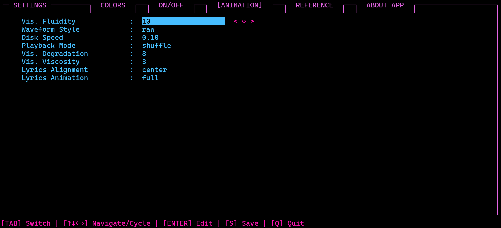

*The ANIMATION tab. The `< ↔ >` hint shows that `←`/`→` cycle the value.*

All rows are cycled with `←`/`→` (or typed after `ENTER`).

| Setting | Values | What it does |
|---|---|---|
| Vis. Fluidity | 1–10 | How the visualizer bars **rise**. It affects only the rising motion. |
| Waveform Style | raw, smooth | Waveform drawing style. Same as the `w` key. |
| Disk Speed | 0.01, 0.05, 0.10, 0.17, 0.25, 0.50, 0.75, 1.00 | How fast the disk spins. |
| Playback Mode | list, loop, shuffle, stop, repeat queue | The play mode. Same as the `m` key (`loop` is the mode shown as *repeat*). |
| Vis. Degradation | 1–10 | How quickly bars **fall**. `1` is a slow, VU-meter-like fade, `10` a near-instant cutoff. |
| Vis. Viscosity | 1–10 | How strongly the bar motion is damped and smoothed between neighbouring bars. |
| Lyrics Alignment | left, center, right | Where lyric lines sit in their area. |
| Lyrics Animation | full, word by word, line by line, letter by letter, active line only, active word only | How lyrics are revealed and highlighted as the song plays. |

### Tab 4: REFERENCE

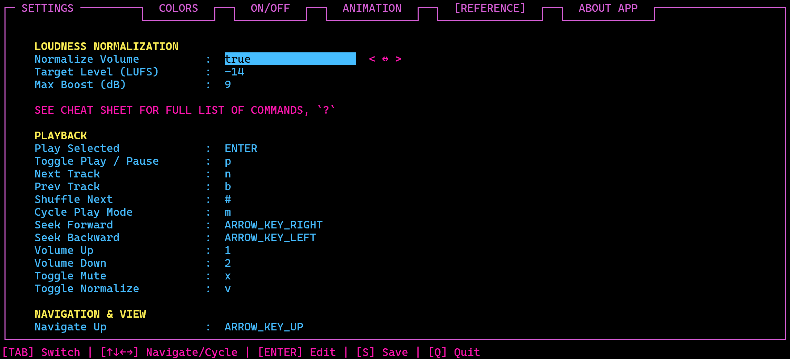

*The REFERENCE tab: loudness normalization at the top, then the rebindable hotkeys (scroll for the rest).*

The longest tab. It scrolls as one list and has three parts.

**LOUDNESS NORMALIZATION** (editable)

| Row | Values | What it does |
|---|---|---|
| Normalize Volume | true / false | Same switch as on the ON/OFF tab and the `v` key. |
| Target Level (LUFS) | -40 to 0 | The loudness every track is measured against and played at. `-16` leaves more headroom, `-14` matches YouTube and Spotify. A lower number is quieter overall. |
| Max Boost (dB) | 0 to 24 | The most a quiet track may be raised. Loud or heavily compressed tracks are lowered regardless. |

**Hotkeys** (editable). Below a grey note pointing to the cheat sheet (`?`), the rebindable commands are listed under the headers PLAYBACK, NAVIGATION & VIEW, SEARCH, QUEUE, PLAYLISTS, META EDITOR, HISTORY, DOWNLOADS and SYSTEM. Each row shows a label and the key currently bound to it.

- Press `ENTER` on a row, type the new key, and press `ENTER` again.
- A key is written as the character itself (`n`, `T`, `#`, `+`) or as a name: `ENTER`, `TAB`, `SPACE`, `ESC`, `BACKSPACE`, `ARROW_KEY_UP`, `ARROW_KEY_DOWN`, `ARROW_KEY_LEFT`, `ARROW_KEY_RIGHT`.
- If the key is **already used by another action**, the change is refused with `KEY "x" ALREADY USED BY <action> -- try another key`, and you can type another one.
- The search prefixes (`/`, `/s:`, `/p:`) appear here too and are edited the same way.
- Keys that are **not** rebindable (`ESC`, `SHIFT+B`, the playlist and meta editors' own keys, `CTRL+SHIFT+S/X`) are not listed. The cheat sheet shows those.

**FONT / CHARACTER MAP** (read-only). Shows the `A = A, a` table from `config.txt`, which lets you re-font the interface with fancy Unicode letters without changing the terminal font. It cannot be edited here. Edit the `font_en={ … }` block in `config.txt` while the app is closed.

### Settings that exist only in `config.txt`

| Key in `config.txt` | What it does |
|---|---|
| `ReplaceEmoji` | `true` draws an emoji in a title as a single `?` so box borders stay aligned. `false` draws the real emoji. |
| `ConsoleVerbosity` | `basic` logs every command the app runs and its raw output. `verbose` adds internal and OS-level events. |
| `AutoSave` | Resumes the exact song, position, queue and play mode at the next launch. |
| `AutoSaveIndicator`, `AutoSaveChr`, `AutoSaveIndicatorType`, `AutoSaveC1`, `AutoSaveC2` | The small autosave indicator: whether it shows, its character, `blink` or `color` style, and the two pulse colours. |
| `AutoSaveDelayInSec` | How often the session snapshot is saved (default 30 seconds). |
| `UpperLeftCorner`, `Vertical`, `Horizontal`, `Seprator`, `ListSeparator` and the other border entries | The characters used to draw frames and the list column separator. |

---

## About this app

### Original developer of v1.0

| | | | |
|---|---|---|---|
| **Developer** | ender | **GitHub** | [itzender5820](https://github.com/itzender5820) |
| **Email** | itz.ender5820@gmail.com | **Version** | original and final v1.0 |
| | | **Licence** | Apache Licence 2.0 |

### Windows port, incl. extensive modifications up to v2.x.x

| | | | |
|---|---|---|---|
| **Developer** | Steffen Schwerdtfeger | **GitHub** | [StSchwerdtfeger](https://github.com/StSchwerdtfeger) |
| **Email** | fanti.blub@gmail.com | **Version** | current v2.1.0 |
| | | **Licence** | Apache Licence 2.0 |
